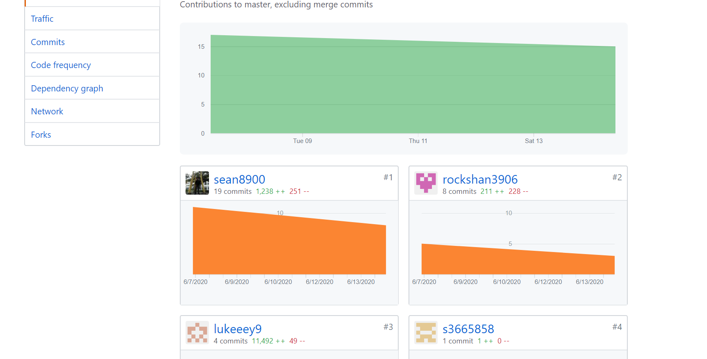
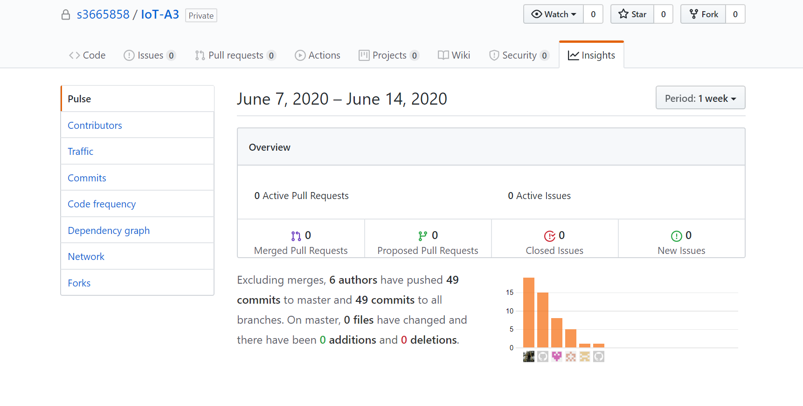
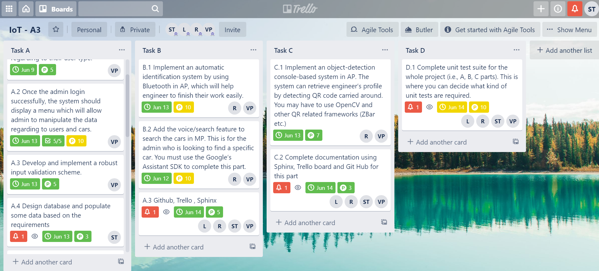

# IoT-A3

## Introduction
Our project is a Car Rental system running on python using the microframework Flask. Our main method which is used to run the entire system is called 'run.py', located in the root folder of our project. Our html and API scripts are all seperated neatly in subfolders for better management.

## Instructions
1. Install the required packages listed in the requirements.txt file
2. On your pi terminal in the root folder of our project, run 'python run.py'

## Accounts available
- Username: vincent, Password: 1234, Account Type: User
- Username: admin, Password: admin, Account Type: Admin
- Username: engineer1, Password: 1234, Account Type: Engineer
- Username: manager1, Password: 1234, Account Type: Manager

## GitHub Usage
We have been actively managing our project work using GitHub, due to some git issues some of our group member's contribution are not properly reflected in GitHub Insights as their account was not properly identified when pushing commits, below are the screenshots of GitHub Insights:

## Trello Usage
We manage the subtasks of our project in an orderly manner using Trello, which details all the tasks which needs to be done for the 
project and who is in charge of them.

